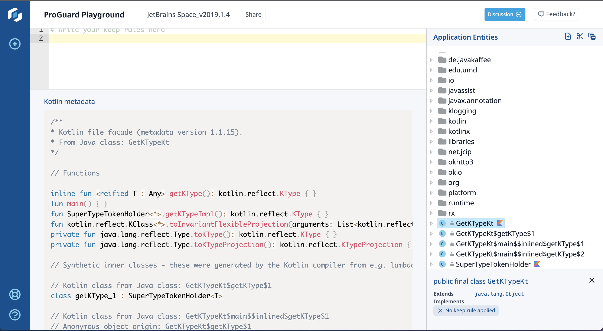

<h1 align="center">Kotlin Metadata Printer</h1>

<!-- Badges -->
<p align="center">
  <!-- CI -->
  <!--a href="https://github.com/Guardsquare/kotlin-metadata-printer/actions?query=workflow%3A%22Continuous+Integration%22">
    
  </a-->

  <!-- Github version -->
  <!--a href="releases">
    
  </a-->

  <!-- Maven -->
  <!--a href="https://search.maven.org/search?q=g:com.guardsquare">
    
  </a-->

  <!-- License -->
  <a href="LICENSE">
    
  </a>

  <!-- Twitter -->
  <a href="https://twitter.com/Guardsquare">
    
  </a>
</p>

The Kotlin metadata printer is a free tool to print the Kotlin metadata in
a human-readable format. The printer is built on the
[ProGuardCORE](https://github.com/Guardsquare/proguard-core) library and can
process class files, zip files, jars or apks.

The Kotlin metadata printer is integrated in [ProGuard Playground](https://playground.proguard.com/) or you can run it [locally](#executing).

<a href="https://tools.guardsquare.com/kotlin-metadata-printer/">
  
</a>

## Building

You can build the Kotlin metadata printer jar by executing the following Gradle command:

    ./gradlew build

Once built a jar will be created in lib/kotlin-metadata-printer.jar

## Executing

You can execute the printer directly through gradle as follows:

    ./gradlew :kmp-cli:run --args "input.{apk,jar,zip,class}"

Or you can execute the built printer jar as follows:

    java -jar lib/kotlin-metadata-printer.jar input.{apk,jar,zip,class}

## Options

    --filter '<classNameFilter>' class name filter e.g. --filter '!android.**,com.mypackage.**'
    --output '<outputFile>'      write output to this file instead of stdout e.g. --output 'myfile.txt'
    --json                       output the metadata in a JSON structure
    --divider                    a string that is printed between each Kotlin metadata

## Example

The following example is a basic Android activity class written in Kotlin:

```kotlin
/**
 * Sample activity that displays "Hello world!".
 */
class HelloWorldActivity : AppCompatActivity() {
    override fun onCreate(savedInstanceState: Bundle?) {
        super.onCreate(savedInstanceState)
        setContentView(R.layout.activity_main)
    }
}
```

and this is its associated metadata as printed by the Kotlin metadata printer:

```
/**
* Kotlin class.
* From Java class: com.example.HelloWorldActivity
*/
class HelloWorldActivity : android.support.v7.app.AppCompatActivity {

    // Functions

    protected open fun onCreate(savedInstanceState: android.os.Bundle?) { }
}
```

## Using as a library

The project is split into CLI (`kmp-cli`) and library (`kmp-lib`) modules. To use the 
printer programmatically from your project add a dependency on the library and then use 
the `KotlinMetadataPrinter` class along with a ProGuardCORE `ClassPool`. The printed 
metadata is placed into the processing info field of the `Clazz`.

```java
import static proguard.io.util.IOUtil.read;

public class Main
{
    public static void main(String[] args)
    {
        ClassPool programClassPool = IOUtil.read(args[0], false);
        programClassPool.classesAccept(
            new ReferencedKotlinMetadataVisitor(
            new KotlinMetadataPrinter(programClassPool))
        );

        programClassPool.classesAccept(clazz -> System.out.println(clazz.getProcessingInfo()));
    }
}
```

## Contributing

The **Kotlin metadata printer** is built on the
[ProGuardCORE](https://github.com/Guardsquare/proguard-core) library.

Contributions, issues and feature requests are welcome in both projects.
Feel free to check the [issues](issues) page and the [contributing
guide](CONTRIBUTING.md) if you would like to contribute.

## License

The **Kotlin metadata printer** is distributed under the terms of
the [Apache License Version 2.0](LICENSE).

Enjoy!

Copyright (c) 2002-2022 Guardsquare NV
